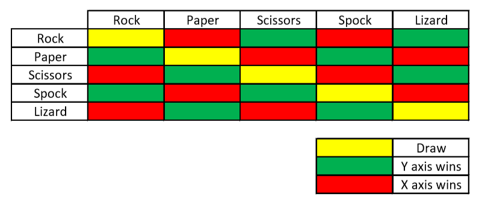

# Rules of the game

Here is the rules of the game.
'''As Sheldon explains, "Scissors cuts paper, paper covers rock, rock crushes lizard, lizard poisons Spock, Spock smashes scissors, scissors decapitates lizard, lizard eats paper, paper disproves Spock, Spock vaporizes rock, and as it always has, rock crushes scissors."'''
Source: [https://the-big-bang-theory.com/rock-paper-scissors-lizard-spock]()

One const with computer name to be choosen randomly.

One object for player with:
* previousScore
* choice
* score
* name
* type (computer/human)

## The Game

### Pseudocode

If name of player doesn't exist then getPlayerName()
Then ask for getPlayerChoice()
Generate random number to pick a choice for the computer
Compare who is the winner!
Add score to the winner
Display who is the winner
Display score
Restart 

### Truth Table
